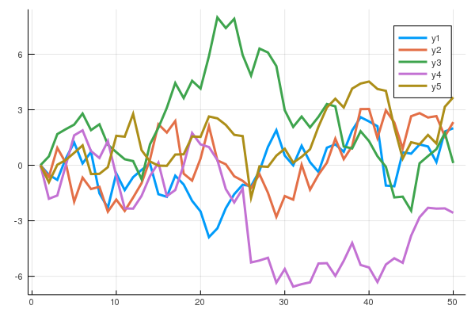

JuliaCall in R Markdown
================
Changcheng Li
2019-08-05

## Use JuliaCall as Julia Engine in R Markdown

To use `JuliaCall` package for julia engine in R Markdown document, just
set the language of the code chunk to be `julia`.

``` julia
## This is a julia language chunk.
## In julia, the command without ending semicolon will trigger the display
## so is JuliaCall package. 
## The julia display will follow immediately after the corresponding command
## just as the R code in R Markdown.

a = sqrt(2);
a = sqrt(2)
```

    ## 1.4142135623730951

### Support for `Plots.jl`

`Plots.jl` is an easy to use and powerful julia package for plotting,
see <https://github.com/JuliaPlots/Plots.jl> for more detail. Before the
first time using `Plots.jl`, you first need to install the package like:

``` julia
import Pkg; Pkg.add("Plots")
```

After installation of the package, you can use it like this:

``` julia
using Plots
gr()
```

    ## Plots.GRBackend()

``` julia
plot(Plots.fakedata(50,5),w=3)
```

<!-- -->

## Get Access to Julia in R Chunk

You can also get access to julia variables in R code chunk quite easily
using `JuliaCall`, for example:

``` r
library(JuliaCall)
## This is a R language chunk.
## In the previous julia chunk, we define variable a, 
## we can use functions in JuliaCall to get access to it.
julia_eval("a")
```

    ## [1] 1.414214
